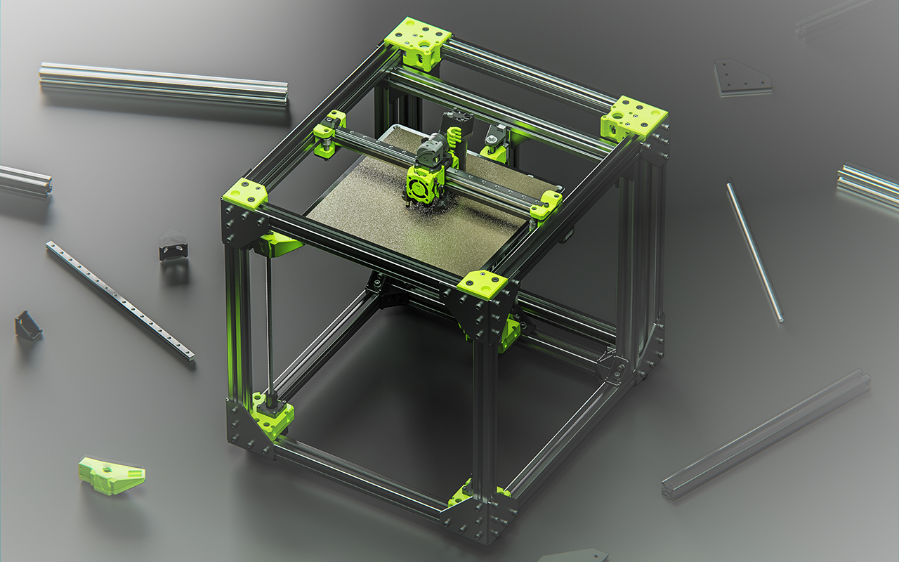

## What is the Rat Rig Lab?

Through the Rat Rig Lab, we share designs and ideas which fall into the following categories:

### Official Mods
Sometimes we need a particular part which we design internally. An example being an IEC socket mount which bolts onto an aluminium 3030 extrusion. These parts are developed but do not belong to any particular product we provide. This section will serve as a home to all of those designs, so that members of the community can use them if they find the need. We provide both STEP and STL files for each, ready to be printed or added into your own mods.

### Upcoming & Prototype Products
From prototypes early in the development process, to designs nearing to official announcement and release. This section houses projects which we aim to make commercially available.

### Non-commercial Designs
The research and development process does not always result in a product that is commercially viable at the time. This section contains those designs which did not become a product we currently sell, but that we may revisit in the future. We share and document these designs, as well as the ideas and timelines behind them in this section. You can also find CAD models and the bill of materials should someone wish to build the design for themselves.

### Discontinued Products
Products are sometimes superseded with new and improved versions, or simply no longer sell and are discontinued. Here you can find products which fall into these categories. We provide the CAD models, and the full bill of materials, so that these designs are never lost.

### CAD Repository
Most of the components we use in our CAD models are modelled in-house. This section is a repository of those CAD models which are available for the community to use in their own designs. By using our official models, you can be assured that the design you create wil match the product you can purchase.

## License

Unless specified otherwise, all content published on the Rat Rig Lab is licensed under the <a rel="license" href="http://creativecommons.org/licenses/by-nc-sa/4.0/">Creative Commons Attribution-NonCommercial-ShareAlike 4.0 International License</a>
