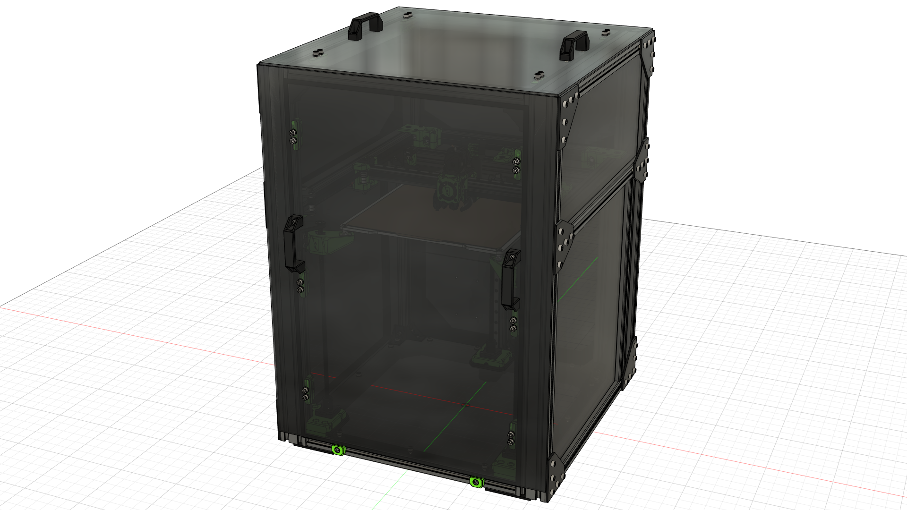
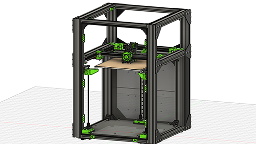
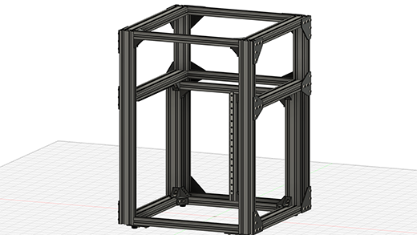
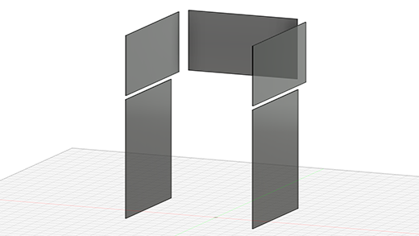
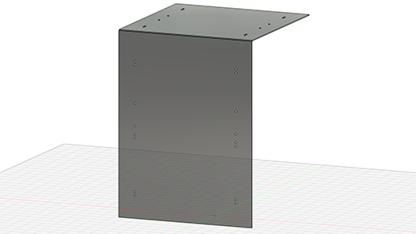

## About the V-Core 3.1 "Beast" Enclosure
This prototype was created during the development of the 2.0 enclosure for the V-Core 3.1. The design goal was to create an enclosure which only needed regular square panels, which would be cheaper and easier to acquire.

The design was ultimately abandoned due to multiple issues with machine maintenance when the panels are installed in such a way:

- Removing any of the side panels required partial disassembly of the machine frame, which was likely to cause the CoreXY system to need realignment
- The width of the frame increased by 60mm due to the use of 3060 extrusions on the sides
- The weight of the frame increased considerably due to the requirement of 3060 extrusions in various places

Ultimately, due to the issues mentioned above, this design was abandoned in favour of one which used panels screwed to the frame.

## Development Timeline
> 11/10/2022 - Added to Rat Rig Lab  
> 21/07/2022 - Prototype design complete  
> 18/07/2022 - Prototyping

## Gallery
{ target=_blank }
{ target=_blank }
{ target=_blank }
{ target=_blank }

## CAD
[:material-file-cad-box: Click here to view the CAD on the Rat Rig Fusion 360 viewer](https://a360.co/3Tad6do){: .md-button .md-button--primary target=_blank }

## Bill of Materials
!!! attention "BOM Limitations"
    The bill of materials below is based upon a full machine build with a 300x300x300 print volume.
    
    Components required to build the EVA3 tool head are not listed.
{{ hardware_bom("assets/vc31_beast_enclosure/bom.csv") }}

## Printed Parts
!!! attention "EVA3 Printed Parts"
    Printed parts required to build the EVA3 tool head are not listed below.
{{ printed_parts_bom_minimal("assets/vc31_beast_enclosure/printed_parts.csv") }}

## License

Unless specified otherwise, all content published on the Rat Rig Lab is licensed under the <a rel="license" href="http://creativecommons.org/licenses/by-nc-sa/4.0/">Creative Commons Attribution-NonCommercial-ShareAlike 4.0 International License</a>
