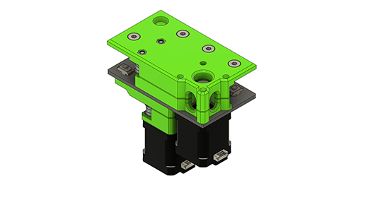

## About the V-Core 3.1 IDEX "Wide Boy"
The "IDEX" (or Independent Dual Extruder) version of the V-Core 3.1 was designed, in part, to fill the gap left by the discontinuation of the Rat Rig V-Cast.

### Variants
Due to the space constraints caused by requiring two EVA tool heads, the IDEX V-Core 3.1 was developed into two separate designs. This page details the "wide boy" design which increases the size of the frame in the X-axis direction. This allows for the full print volume of the original, although has the downside of being a physically larger machine. The alternate design, which features the same external dimensions as a non-IDEX V-Core 3, uses a smaller print bed and a bed subframe.

Details of the alternate design can be found on its own page [accessed by clicking here](/vc31_idex/).

### Kinematics
Adaptions to the kinematics were required to make IDEX work on the V-Core 3.1. The kinematics chosen are widely known as "Dual Markforge" kinematics. Two NEMA17 new stepper motors are used to drive the Y-axis (one per side), and then the existing A/B NEMA17 steppers are used to drive the two tool heads.

## Development Timeline
> 11/10/2022 - Published to Rat Rig Lab  
> 04/07/2022 - V-Core 3.1 IDEX prototype design complete  
> 14/04/2022 - Prototyping for V-Core 3.1  
> 24/01/2021 - V-Core 3.0 IDEX prototype design complete  
> 30/09/2021 - Prototyping

## Known issues
> 1 - The Y-axis endstop has an interference issue with the Y-axis IDEX belts  
> 2 - The front lead screw constraints are customised due to an interference issue with the stock design

## Gallery
{ target=_blank }
{ target=_blank }
{ target=_blank }
{ target=_blank }

## CAD
[:material-file-cad-box: Click here to view the CAD on the Rat Rig Fusion 360 viewer](https://a360.co/3CtRwJU){: .md-button .md-button--primary target=_blank }

## Bill of Materials
!!! attention "BOM Limitations"
    The bill of materials below is based upon a full machine build with a 300x300x300 print volume.
    
    Components required to build the EVA3 tool heads are not listed.
{{ hardware_bom("assets/vc31_idex_wide/bom.csv") }}

## Printed Parts
!!! attention "EVA3 & IDEX Printed Parts"
    EVA3 does not currently support IDEX, therefore modified EVA3 back printed parts are provided in the CAD (eva3_idex_back_x1 & eva3_idex_back_x2).

    Printed parts required to build the EVA3 tool heads are not listed below.
{{ printed_parts_bom_minimal("assets/vc31_idex_wide/printed_parts.csv") }}

## License

Unless specified otherwise, all content published on the Rat Rig Lab is licensed under the <a rel="license" href="http://creativecommons.org/licenses/by-nc-sa/4.0/">Creative Commons Attribution-NonCommercial-ShareAlike 4.0 International License</a>
