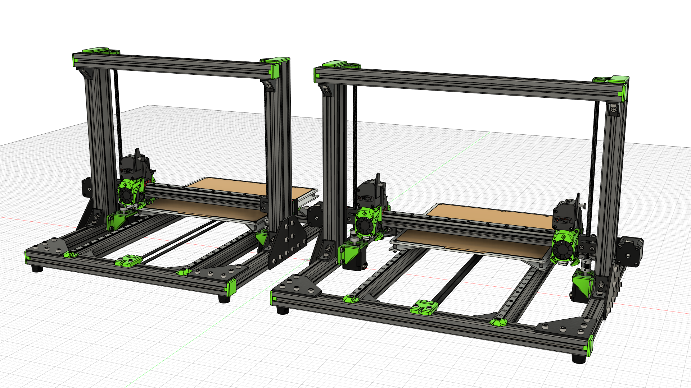
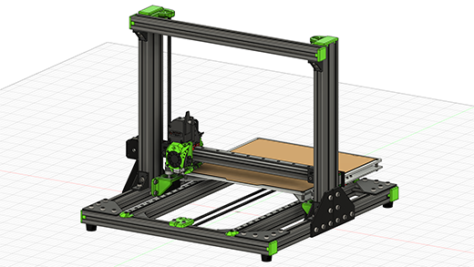
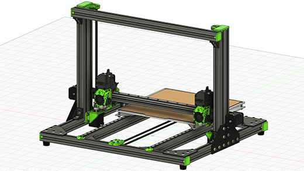

## About the V-Cast 1.0

### Variants
The V-Cast features two variants, both of which can be used with either a single extruder, or a pair of extruders for IDEX.

The wider frame, unofficially dubbed the "wide boy", was created to allow the extruder(s) to completely leave the print volume when not in use. This is important for the IDEX configuration as it allows both extruders to reach all points on the print bed, thus enabling the full print volume in multi-colour or multi-material prints.

### Kinematics
The V-Cast uses standard Cartesian kinematics. Unofficially these are often referred to as "bed slingers", as the print bed (and as such the print itself) moves in the Y direction during operation.

## Development Timeline
> 11/10/2022 - Published to Rat Rig Lab  
> 09/02/2022 - Discontinued  
> 01/09/2020 - Launched  
> 26/05/2020 - Beta Testing  
> xx/xx/2020 - V-Cast 1.0 prototype design complete  
> xx/xx/2020 - Prototyping

## Gallery
{ target=_blank }
{ target=_blank }

## CAD
[:material-file-cad-box: Rat Rig V-Cast v1.0 CAD](https://a360.co/3TbjzVw){: .md-button .md-button--primary target=_blank } [:material-file-cad-box: Rat Rig V-Cast v1.0 "Wide Boy" CAD](https://a360.co/3Tpx1Vi){: .md-button .md-button--primary target=_blank }

## Bill of Materials
!!! attention "BOM Limitations"
    The bill of materials lists only the parts required for the mechanical build. Electronics
    Components required to build the EVA2 tool heads are not listed.

### V-Cast 1.0 Standard Frame
{{ hardware_bom("assets/vcast_1_0/bom.csv") }}

### V-Cast 1.0 "Wide Boy" Frame
{{ hardware_bom("assets/vcast_1_0/bom_wide.csv") }}

### V-Cast 1.0 IDEX Additions
{{ hardware_bom("assets/vcast_1_0/bom_idex_additions.csv") }}

## Printed Parts
!!! attention "EVA2 Printed Parts"
    Printed parts required to build the EVA2 tool heads are not listed below.
{{ printed_parts_bom_minimal("assets/vcast_1_0/printed_parts.csv") }}

## License

Unless specified otherwise, all content published on the Rat Rig Lab is licensed under the <a rel="license" href="http://creativecommons.org/licenses/by-nc-sa/4.0/">Creative Commons Attribution-NonCommercial-ShareAlike 4.0 International License</a>
