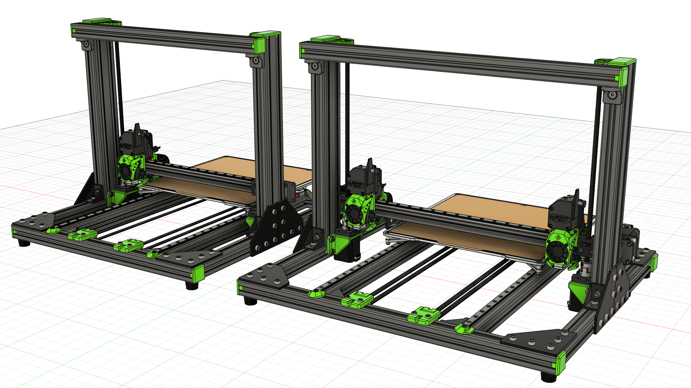
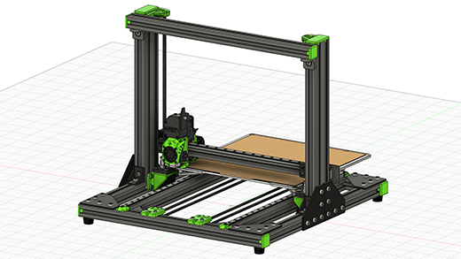
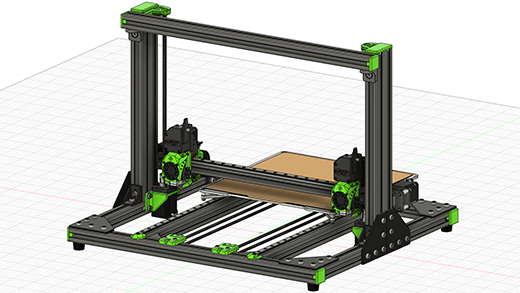

## About the V-Cast 1.5
The V-Cast 1.5 was developed as an upgrade to the original V-Cast 1.0 design. It was intended to be an incremental update, rather than a full redesign. It improved upon the original in several ways:

- Complete redesign of the X-axis transmission for both single and IDEX configurations
- Relocated the X and U-axis motors to be inside the frame, decreasing the total width of the machine by 62mm in IDEX
- New three point rigid bed mounting, using the same machined bed plates as the V-Core 3
- Updated Y-axis carriage, which is stronger, yet lighter
- Addition of a second Y-axis motor for additional torque when moving the bed
- Addition of axial thrust bearings & pillow blocks to both Z-axis motor assemblies

### Variants
The V-Cast 1.5 features the same two variants as the V-Cast 1.0, both of which can be used with either a single extruder, or a pair of extruders for IDEX.

The wider frame, unofficially dubbed the "wide boy", was created to allow the extruder(s) to completely leave the print volume when not in use. This is important for the IDEX configuration as it allows both extruders to reach all points on the print bed, thus enabling the full print volume in multi-colour or multi-material prints.

### Kinematics
The V-Cast uses standard Cartesian kinematics. Unofficially these are often referred to as "bed slingers", as the print bed (and as such the print itself) moves in the Y direction during operation.

## Development Timeline
> 11/10/2022 - Published to Rat Rig Lab  
> 08/02/2022 - V-Cast 1.5 prototype design complete  
> 22/09/2021 - Prototyping

## Gallery
{ target=_blank }
{ target=_blank }

## CAD
[:material-file-cad-box: Rat Rig V-Cast v1.5 CAD](https://a360.co/3S9SQY0){: .md-button .md-button--primary target=_blank } [:material-file-cad-box: Rat Rig V-Cast v1.5 "Wide Boy" CAD](https://a360.co/3ySI41x){: .md-button .md-button--primary target=_blank }

## Bill of Materials
!!! attention "BOM Limitations"
    The bill of materials lists only the parts required for the mechanical build. Electronics
    Components required to build the EVA2 tool heads are not listed.

### V-Cast 1.5 Standard Frame
{{ hardware_bom("assets/vcast_1_5/bom.csv") }}

### V-Cast 1.5 "Wide Boy" Frame
{{ hardware_bom("assets/vcast_1_5/bom_wide.csv") }}

## Printed Parts
!!! attention "EVA2 Printed Parts"
    Printed parts required to build the EVA2 tool heads are not listed below.
{{ printed_parts_bom_minimal("assets/vcast_1_5/printed_parts.csv") }}

## License

Unless specified otherwise, all content published on the Rat Rig Lab is licensed under the <a rel="license" href="http://creativecommons.org/licenses/by-nc-sa/4.0/">Creative Commons Attribution-NonCommercial-ShareAlike 4.0 International License</a>
