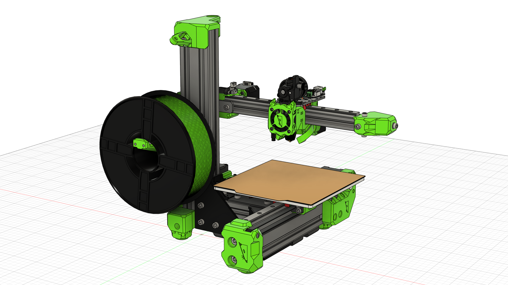
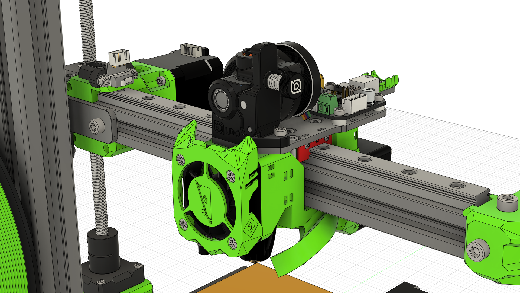
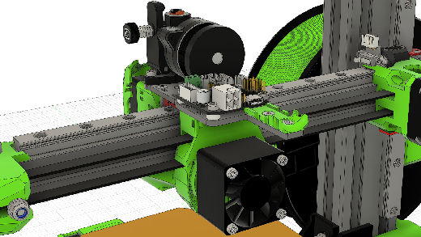
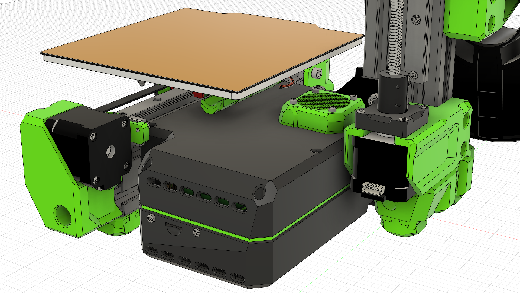
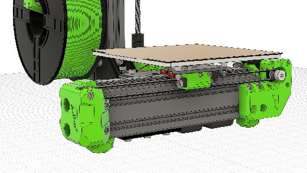

## About the V-Minion 1.1 Alpha
The V-Minion 1.1 was developed as an upgrade to the original V-Minion 1.0 design. It was intended to be an incremental update, rather than a full redesign. It improved upon the original in several ways:

- Removal of the external electronics enclosure, integrating them onto the V-Minion frame in a fully printed enclosure
- Addition of electronics cooling on the new enclosure
- Support for the BigTreeTech SKRat V1.0 motherboard
- Updated toolhead design, based upon the Rat Rig toolhead featured on the V-Core 3.1 and V-Core 4.0
- Improved routing and support of the bed cables
- Integrated lead screw decoupler on the Z-axis

### Kinematics
The V-Minion uses standard Cartesian kinematics. Unofficially these are often referred to as "bed slingers", as the print bed (and as such the print itself) moves in the Y direction during operation. As the Z-axis is only supported at one end, the V-Minion is considered to be a cantilevered design.

## Development Timeline
> 15/10/2024 - Published to Rat Rig Lab  

## Gallery
{ target=_blank }
{ target=_blank }
{ target=_blank }
{ target=_blank }

## CAD
[:material-file-cad-box: Rat Rig V-Minion 1.1 Alpha CAD](https://a360.co/48ehnFa){: .md-button .md-button--primary target=_blank }

## Bill of Materials
!!! attention "BOM Unavailable"
    At this time, no BOM is provided for the V-Minion 1.1. Please use the provided CAD model instead.

## License

Unless specified otherwise, all content published on the Rat Rig Lab is licensed under the <a rel="license" href="http://creativecommons.org/licenses/by-nc-sa/4.0/">Creative Commons Attribution-NonCommercial-ShareAlike 4.0 International License</a>
